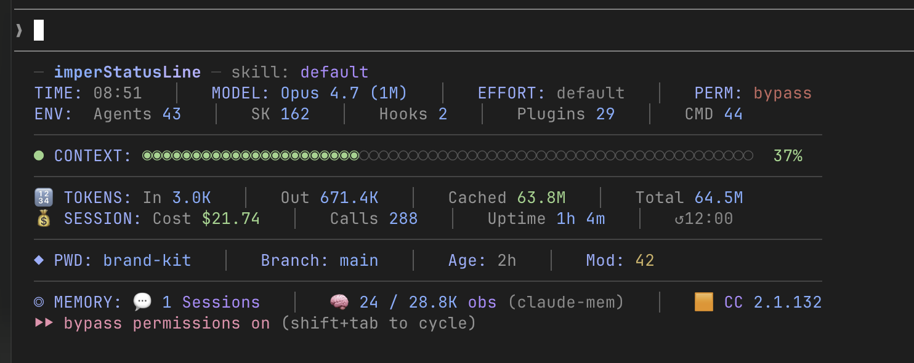

# imperStatusLine

A custom status line for [Claude Code](https://docs.claude.com/en/docs/claude-code/overview), inspired by Daniel Miessler's [PAI](https://github.com/danielmiessler/Personal_AI_Infrastructure) status line — but **standalone**: no PAI framework required.



## What you see

```
─ imperStatusLine ─ skill: <output_style>
TIME: 08:51   │   MODEL: Opus 4.7 (1M)   │   EFFORT: default   │   PERM: bypass
ENV:  Agents 43   │   SK 162   │   Hooks 2   │   Plugins 29   │   CMD 44
──────────────────────────────────────────────────────────────────────────
● CONTEXT: ◉◉◉◉◉◉◉◉◉◉◉◉◉◉◉◉◉◉◉◉◉◉◉◯◯◯◯◯◯◯◯◯◯◯◯◯◯◯◯◯◯◯◯◯◯◯◯◯◯◯◯◯◯◯  37%
──────────────────────────────────────────────────────────────────────────
🔢 TOKENS:  In 3.0K   │   Out 671.4K   │   Cached 63.8M   │   Total 64.5M
💰 SESSION: Cost $21.74   │   Calls 288   │   Uptime 1h 4m   │   ↺12:00
──────────────────────────────────────────────────────────────────────────
◆ PWD: brand-kit   │   Branch: main   │   Age: 2h   │   Mod: 42
──────────────────────────────────────────────────────────────────────────
◎ MEMORY: 💬 1 Sessions   │   🧠 24 / 28.8K obs (claude-mem)   │   🟧 CC 2.1.132
──────────────────────────────────────────────────────────────────────────
▸ TASKS: 2 bg   │   1 agent       (only when active)
```

## Sections explained

### Header

| Field | Meaning |
|---|---|
| **skill** | The currently active output style (e.g. `default`, `explanatory`, a custom style) — read from `output_style.name`. |

### Row 1 — Time / Model / Effort / Perm

| Field | Source | Meaning |
|---|---|---|
| **TIME** | system clock | Local wall-clock time. |
| **MODEL** | stdin JSON `model.id` | Friendly model label: `Opus 4.7`, `Sonnet 4.6`, `Haiku`, with `(1M)` suffix for 1M-context variants. |
| **EFFORT** | `CLAUDE_THINKING_LEVEL` env → `THINKING_BUDGET` env → `settings.json` | Thinking budget label (`default` / `low` / `medium` / `high` / `max`). Color-coded: green = low cost, yellow = medium, red = max. |
| **PERM** | stdin `permission_mode` (with fallback to `permissionMode` in transcript) | Current permission mode — `default` (green), `accept` (yellow), `bypass` (red), `plan` (purple). At-a-glance "are you running with a safety net?" |

### Row 2 — ENV / counts

What the current Claude Code environment can do.

| Field | Source | Meaning |
|---|---|---|
| **Agents** | walks `installPath` of installed plugins + `~/.claude/agents/` | Total subagents available. When sub-agents are running, format becomes `43 (4 active)`. |
| **SK** | walks installed plugins + `~/.claude/skills/` | Skills available (anything with a `SKILL.md`). |
| **Hooks** | `settings.json → hooks` | Number of hook entries configured. |
| **Plugins** | `~/.claude/plugins/installed_plugins.json` (v2 schema) | Installed plugins. |
| **CMD** | walks installed plugins + `~/.claude/commands/` | Slash commands available. |

> All counts come from **plugins actually installed** (via `installPath`), not from the marketplace registries — so the numbers reflect what Claude Code really loads, not what is *available* to install.

### CONTEXT bar

A full-width bar showing how much of the model's context window is currently in use.
Color: green (<60%), yellow (60–80%), red (≥80%).

- For Opus 4.7 1M and `*-1m` models the cap is **1,000,000 tokens**.
- For everything else the cap is **200,000 tokens**.
- The "used" value is the **last main-chain entry's** `input_tokens + cache_read + cache_creation` — the live context length, the way [ccstatusline](https://github.com/sirmalloc/ccstatusline) measures it.

### Row 3 — TOKENS (cumulative session totals)

These are **session totals**, not the last call. Don't be surprised if `In` looks tiny — that's the prompt cache doing its job.

| Field | Meaning |
|---|---|
| **In** | New input tokens spent this session — i.e. content NOT served from prompt cache. With caching this stays small. |
| **Out** | Tokens generated by the model. |
| **Cached** | `cache_read + cache_creation` summed across the whole session. The bulk of cost-saved volume. |
| **Total** | `In + Out + Cached`. |

> **Why "Cached" goes into the millions:** every turn the model rereads (most of) the context from cache, so the counter accumulates fast. On a 1-hour session with a 150K context, hitting tens of millions is normal and means caching is working.

### Row 4 — SESSION meta

| Field | Source | Meaning |
|---|---|---|
| **Cost** | stdin JSON `cost.total_cost_usd` | Running session cost in USD, as reported by Claude Code. |
| **Calls** | finalized assistant entries in the transcript | Number of API calls completed (filtered by `stop_reason` to skip streaming partials). |
| **Uptime** | first/last timestamps in the transcript | Real wall-clock time of this session. |
| **↺HH:MM** | `ccusage blocks --active` | When the next 5h ccusage rolling window resets. Hidden if `ccusage` cache is empty. |

### Row 5 — PWD + git

| Field | Meaning |
|---|---|
| **PWD** | Last segment of the working directory. |
| **Branch / Age / Mod / Sync** | Git branch, age of last commit, count of uncommitted files, ahead/behind upstream. Hidden when not in a git repo. |

### Row 6 — MEMORY

| Field | Meaning |
|---|---|
| **💬 Sessions** | Number of `.jsonl` transcript files for this project — i.e. how many times you've started Claude Code in this directory. Includes the current session. |
| **🧠 obs (claude-mem)** | Observations from the [claude-mem](https://github.com/thedotmack/claude-mem) plugin's SQLite DB at `~/.claude-mem/claude-mem.db`. Shown as `local / total` when this project has any observations recorded, otherwise just the global total. |
| **🟧 CC** | The Claude Code CLI version. |

### Row 7 — TASKS (conditional)

Only appears when there's at least one in-flight item.

| Field | Meaning |
|---|---|
| **N bg** | Background bash tasks (`run_in_background: true`) without a tool result yet. |
| **N agent** | Subagent invocations without a tool result yet. |

## Installation

### Option A — install.sh (recommended)

Clone the repo and run the installer:

```bash
git clone https://github.com/imperugo/imperStatusLine.git
cd imperStatusLine
./install.sh
```

The installer:
1. Copies `imperStatusLine.sh` to `~/.claude/imperStatusLine.sh` (chmod +x).
2. Wires it into `~/.claude/settings.json` under the `statusLine` key.
3. Backs up any existing files it touches (`*.bak.<epoch>`).
4. Clears the runtime cache so the next refresh shows the new version.

It is **idempotent**: running it again on the same machine just reports "already up to date".

### Option B — manual install

```bash
# 1. Save the script
mkdir -p ~/.claude
curl -sL https://raw.githubusercontent.com/imperugo/imperStatusLine/main/imperStatusLine.sh \
  -o ~/.claude/imperStatusLine.sh
chmod +x ~/.claude/imperStatusLine.sh
```

```jsonc
// 2. Add this to ~/.claude/settings.json
{
  "statusLine": {
    "type": "command",
    "command": "bash $HOME/.claude/imperStatusLine.sh",
    "padding": 0
  }
}
```

If you have `jq`:

```bash
jq '.statusLine = {"type":"command","command":"bash $HOME/.claude/imperStatusLine.sh","padding":0}' \
  ~/.claude/settings.json > /tmp/s.json && mv /tmp/s.json ~/.claude/settings.json
```

> Take a backup first: `cp ~/.claude/settings.json ~/.claude/settings.json.bak`

Then open (or send any message in) Claude Code — the new status line shows up at the next refresh.

## Updating

### With install.sh

Pull the latest version and re-run the installer:

```bash
cd imperStatusLine
git pull
./install.sh
```

The installer detects the new version, backs up the old one (`imperStatusLine.sh.bak.<epoch>`), copies the new one in, and clears the cache.

### Manual update

Just overwrite the script:

```bash
curl -sL https://raw.githubusercontent.com/imperugo/imperStatusLine/main/imperStatusLine.sh \
  -o ~/.claude/imperStatusLine.sh
chmod +x ~/.claude/imperStatusLine.sh
rm -rf /tmp/imperstatusline-$USER  # clear cache
```

## Uninstall

```bash
./install.sh --uninstall
```

Removes the script and the `statusLine` entry from `settings.json`. Backups are kept.

Or manually: delete `~/.claude/imperStatusLine.sh` and remove the `statusLine` field from `~/.claude/settings.json`.

## Optional dependencies

| Tool | Required? | Purpose | Install |
|---|---|---|---|
| `jq` | **yes** | JSON parsing (used everywhere) | `brew install jq` / `apt install jq` |
| `sqlite3` | optional | claude-mem `obs` counter | macOS includes it; otherwise `brew install sqlite` |
| `ccusage` | optional | the `↺HH:MM` reset hint on the SESSION row | nothing to install — runs via `npx -y ccusage@latest` automatically (first run downloads it in background) |
| `python3` | optional | parsing the ccusage reset timestamp | macOS includes it |

## How it stays fast

The status line runs at **every Claude Code refresh** — so expensive lookups are cached on disk in `/tmp/imperstatusline-<user>/`:

| Cache | Invalidation | What it stores |
|---|---|---|
| `counts.sh` | TTL 30s | skills, hooks, plugins, slash commands, agents counts |
| `tokens-<hash>.sh` | mtime of the transcript | session token totals + context length + uptime |
| `tasks.txt` | TTL 3s | active background tasks and agents |
| `ccusage.json` | TTL 60s, populated async | output of `ccusage blocks --active` |

The `ccusage` fetch runs **fire-and-forget** in the background, so it never blocks the status line — even when `npx` has to download the package the first time.

## Compatibility

- ✅ macOS (tested on Darwin 25.x)
- ✅ Linux (uses portable POSIX subset; no GNU-only utilities)
- ⚠️ Windows / WSL — should work under WSL bash; native Windows untested

The script avoids macOS-vs-Linux pitfalls (no `tac`, no `timeout`, no GNU-only `find` extensions, both BSD and GNU `date` formats supported).

## Credits

- Layout, color palette, and "render-as-block-with-separators" approach borrowed from [PAI v5.0.0](https://github.com/danielmiessler/Personal_AI_Infrastructure) by Daniel Miessler — credit where credit is due.
- Token-aggregation methodology aligned with [ccstatusline](https://github.com/sirmalloc/ccstatusline) by sirmalloc (filter by `stop_reason` to skip streaming partials, last main-chain entry for context length).
- Strips PAI-specific bits (Workflows, Algorithm, Learning, Quote, Banner, …) and adds Claude-Code-specific signals: EFFORT, PERM, SESSION cost/calls/uptime, the conditional TASKS line, and per-project claude-mem `obs`.

## License

[MIT](./LICENSE) — do whatever you like with it; attribution appreciated.
